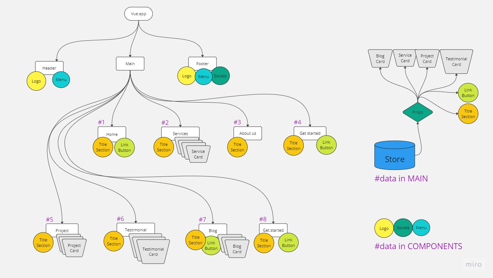

Progetto HTML/VueJS
===

#### Deadline
Lunedì 23 Ottobre ore 20.00

#### Progetto

Riprodurre il layout proposto solo in versione Desktop

Creare un progetto con Vite, strutturando il layout in almeno 3 macro-componenti: **Header**, **Main** e **Footer**.   
Popolare le voci di menù di Header e Footer dinamicamente

## Esercizio 
### **Vedi Schema nel file Project_Diagram.png**

